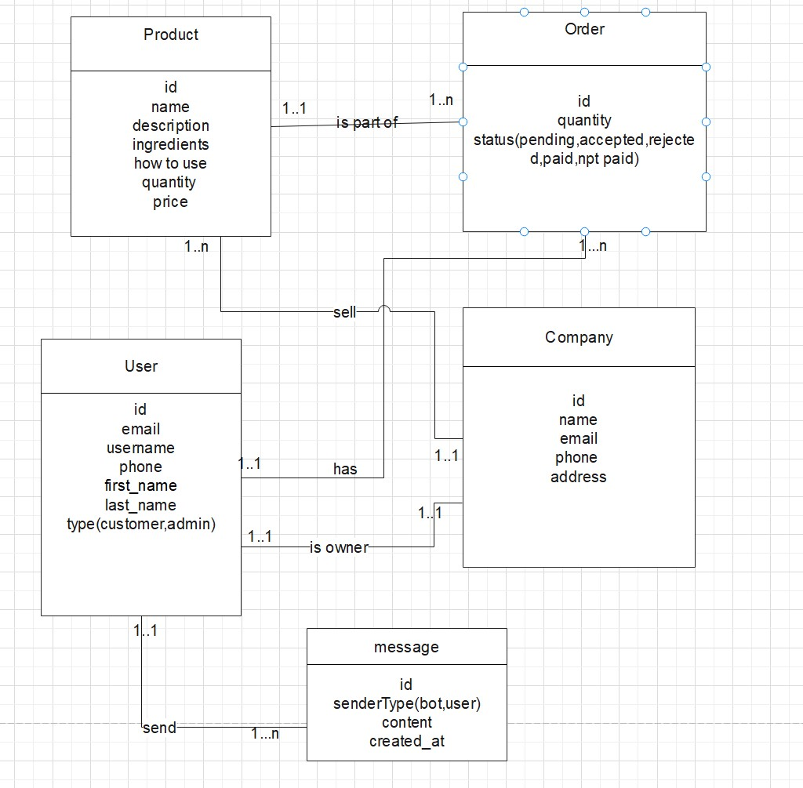

## Skin Care Store Rest Api with AI Assisstant Powered By GEMINI

### Libraries used

- express + typescript
- socket.io + redis
- logger + cors + dotenv + swagger + jest + supertest
- docker
- typeorm + postgresql
- validation with zod
- authentication with google + facebook or by email + username + phone_number
  by using passport , express-session , cookies
- firebase for uploading images + ai assisstant bot

<b>Architecture Pattern : </b> Clean Architecture Pattern

### Database Schema

### How to run server ?

`npm run dev`
