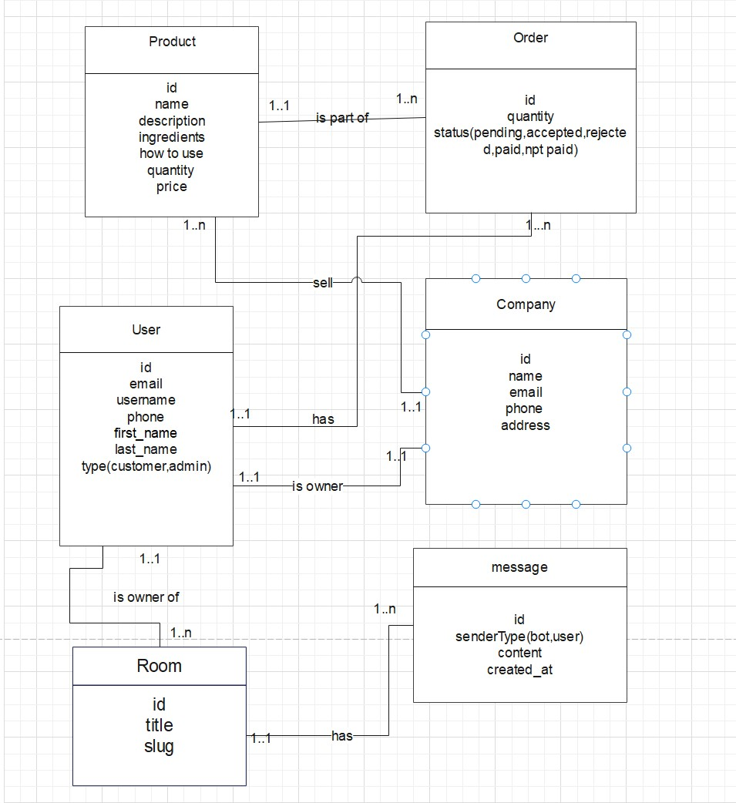

## Skin Care Store Rest Api with AI Assisstant Powered By GEMINI

### Libraries used

- express + typescript
- socket.io
- logger with pino and pino-pretty + cors + dotenv + swagger + jest + supertest
- docker
- typeorm + postgresql
- validation with zod
- authentication by email + username + phone_number
  by using jwt and saving session in DB
- firebase for  ai assisstant bot

<b>Architecture Pattern : </b> Clean Architecture Pattern

### Database Schema

### How to run server ?

`npm run dev`

### How to run test ?

`npm run test`
